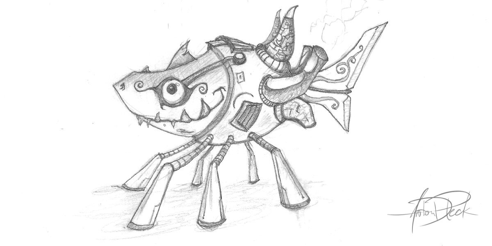

Every so often, I am asked about some of the steps I use to create my art. This blog post is a high-level look at my workflow, using one of my recent illustrations as an example. One of the things you’ll find with me is that I like to keep it loose. Art doesn’t have to be about rules, or making other people happy. But art absolutely can be about finding your own style, and never stop trying to improve on what you enjoy.

## Draw Something!

Clearly, we can’t exactly talk about an artistic workflow, if we don’t start with something. Personally, I absolutely adore fictional creatures that look like they have a much greater story to them. I’ve got a bit of a reputation for robots, but I also love strange little animals, or cute monsters.

In this case, I started with a mashup of a small shark, combined with a robot body. Normally, it takes several doodles for me to find the right look, but with this little guy, the character took his form right from the first draft. When you feel it, you have to run with it.

Something I should mention is that I also like to have the texture of a pencil in my drawings. Some artists prefer smooth inked lines, and that’s great. I do that as well, but the look has worked its way into so many of my drawings, that it’s become a small part of my personal style.

## Scan That Thing!

I have used a variety of scanners over the years and haven’t yet found one that I absolutely love. They all have their quirks. Currently, I’m using an old multifunction HP that does a decent enough of a job. Scanners are pretty inexpensive, so finding one that fits your budget and home office shouldn’t be too difficult.

The scan itself is roughly 4”x6” at 600 dpi. I should also note that when I’m scanning artwork, I switch to grayscale to avoid having any color artifacts in the image later on.
Hello there, mr test-test man!

## Software Choices

_Hoo-boy_, talking about art software could be an entire post all by itself! I’m not going to tackle that monstrosity of a topic just yet. Instead, I’ll keep this short, sweet, and related to the applications that I use and enjoy on a regular basis.

### Regarding Photoshop and Illustrator

Although the Adobe apps have been a part of my career since the very beginning, I no longer use them at home (even for my UI design work). This is not only a budget choice, but a personal challenge, to see if I can accomplish the same level of satisfaction without needing to lean on these apps. So far, I feel like I’m doing okay. Let me know if this is something you would like to hear more about.

### Affinity Photo

This primarily photo-editing based app is truly fantastic. It’s primary target is photography, but it has a pretty solid brush engine. I occasionally use this one for art, but not as often as others further down this list.

### Affinity Designer

As a great replacement for Illustrator, I use this for all of my vector needs, typography, artboards, layouts, and exports. Truly an important part of my workflow.

### Autodesk Sketchbook Pro

The killer feature of Sketchbook is the interface. Truly easy to use, and doesn’t complicate the screen with a gazillion options. I’ve used this app off and on over the years, but so far it has yet to topple my personal favorite…

### Krita

I think my favorite thing about Krita is how absolutely powerful it is. Everything in it is customizable, and has options and features that go on for miles. For some, this could be a bit intimidating, in which case I would recommend Sketchbook, but if you take the time to set it up for your own preferences, it just might surprise you.

## Cleanup

Getting back to the art, possibly the most important step is the cleanup after the scan. This involves adjusting the levels, so that the background is white, and the lines are not-quite black. Take time to erase (or white-paint) stray speckles or unwanted noise that showed up during the scan. Go over the lines, making sure that they look just how you want them before you move on to the next step.

## Color Groups (Flats)

Coloring flats in your artwork involves setting your art layer to a “Multiply” mode so that you can see the layers undeath as you work. Lock your art layer, and use solid colors to paint on new layers (under the artwork) dividing out where you would like unique colors to stand out. I tend to change my mind often, as I use this time to play with color combinations.

## Shading & Texture

Using the basics of light, I imagine a light source, where the highlights would be, and where to apply shadows. Depending on the art, and the style that I’m trying to go for, I’ll also work in some textures. These would help imply different types of skin, or metal surfaces.

This is also my favorite stage of the art, as it really starts to come to life.

## Detail

Adding details might actually be more of a part B. of the previous step, as it’s primarily going back over the artwork with a fine-tooth comb, touching up some highlights, tweaking a color or two, adding any shadows that I previously missed, and so on. Though at some point, it’s good to put your pen down and call it done, so that you can move on to the next great project!

## Moving Forward

If you feel like I missed some of the finer details, fear not: I have more breakdowns planned that will focus more tightly on some of the individual steps, as well as videos coming where you can see these steps recreated in a more detailed manner. Teaching and sharing ideas is something that I’m trying to improve as a personal goal, so I will continue to publish materials that contribute to helping others!

Also, if you have any suggestions, critiques, or specific things that you would like to see - please reach out to me! I’m interested in hearing from you!
